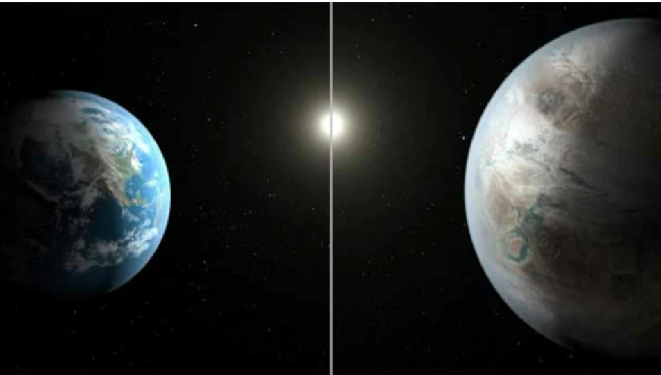
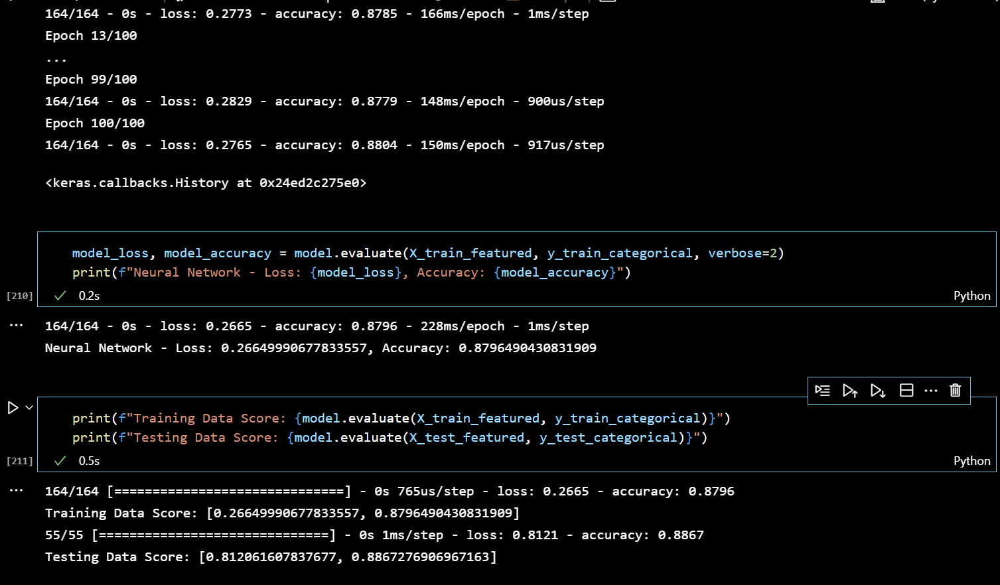
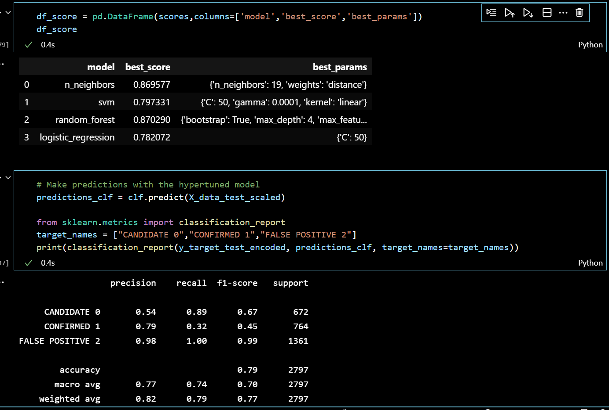

# machine-learning-challenge

Over a period of nine years in deep space, the NASA Kepler space telescope has been out on a planet-hunting mission to discover hidden planets outside of our solar system.

To help process this data, created machine learning models capable of classifying candidate exoplanets from the raw dataset.

This dataset is a cumulative record of all observed Kepler "objects of interest" — basically, all of the approximately 10,000 exoplanet candidates Kepler has taken observations on.

NOTEWORTHY COLUMNS:

koi_disposition: The disposition (the way in which something is placed or arranged, especially in relation to other things) in the literature towards this exoplanet candidate. One of CANDIDATE, FALSE POSITIVE, NOT DISPOSITIONED or CONFIRMED.

koi_score: A value between 0 and 1 that indicates the confidence in the KOI disposition. For CANDIDATEs, a higher value indicates more confidence in its disposition, while for FALSE POSITIVEs, a higher value indicates less confidence in that disposition.

### Preprocessed the Data

* Preprocessed the dataset prior to fitting the model. 
Dropped null rows and null columns where all values are null
* Performed feature selection and removed unnecessary features. 
Using SelectKBest(chi2, k=7) reduced 40 unnecessary columns to 7!
* Used `MinMaxScaler` to scale the numerical data.
* Separated the data into training and testing data. 
Used LabelEncoder and to_categorial to reassign the y koi_disposition column to one-hot-encoding.

Created a normal neural network with 7 inputs, 4 hidden nodes, and 3 outputs:

Neural Network result - Loss: 0.266, Accuracy: 0.879

Accuracy is the ratio of correctly predicted observations to the total number of
observations.

This Neural Network model is good enough to predict new exoplanets with an accuracy of 88% and loss of 27%!

### Tune Model Parameters

* Used `GridSearch` to tune model parameters.
Preprocessed the dataset prior to fitting the model similar to neural network above but this time omitting "to_categorial" to keep y target 2d.

* Tuned and compared with different classifiers namely SVC, RandomForest Classifier and Logistic Regression. The RandomForest Classifier performed the best with a best_score of 0.869!

This Grid scores model is good enough to predict new exoplanets with an accuracy of 87% with RandomForest Classifier!

From sklearn.metrics used classification_report.

Precision is the ratio of correctly predicted positive (CPP) observations to the total
predicted positive observations where FPP is falsely predicted positive.
(Precision = CPP / (CPP + FPP))

Recall is the ratio of correctly predicted positive (CPP) observations to the total
predicted positive observations where FPN is falsely predicted negative.
(Recall = CPP / ((CPP + FPN)

The f1-score gives you the harmonic mean of precision and recall., where an F1
score reaches its best value at 1 (perfect precision and recall) and worst at 0.
F1 = 2 * ( (precision * recall) / (precision + recall) ).
The scores corresponding to every class will tell you the accuracy of the classifier in classifying the data points in that particular class compared to all other classes.

The support is the number of samples of the true response that lie in that class.

FALSE POSITIVE 2 has achieved the closest to 1 of 0.99 score, CANDIDATE 0 follows with 0.67 and CONFIRMED 1 is the lowest at 0.45.

The CANDIDATE 0 is the most important indicator in deciding whether we have discoved a new planet and this Grid model has a 45% chance of predicting this correctly.

